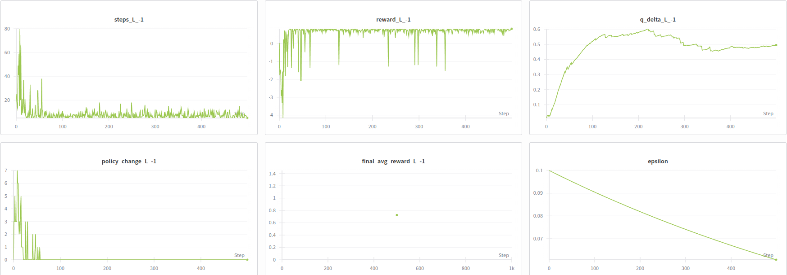

# Gridworld Q-Learning Solution (Online)

## Overview
This repository contains Q-learning-based solution for the 3x4 Gridworld problem.  
The agent learns an optimal policy to reach a goal state while avoiding a losing state and a wall. The environment includes stochastic movement, where actions succeed with 80% probability and deviate with 10% probability to either side. Weights & Biases (W&B) is used to track training details.

## Environment Details
- **Grid Size** : 3 rows x 4 columns
- **Start State** : (1, 1)
- **Goal State** : (3, 4) with reward +1
- **Lose State** : (2, 4) with penalties -1 / -200
- **Wall** : (2, 2)
- **Action** : Up, Down, Left, Right
- **Movement** : Stochastic with 80% probability of moving in the desired direction, 10% left, and 10% right. The agent stays in the same place if it hits a wall or grid boundary
- **Reawards**:
  - Goal state : + 1
  - Lose state: -1 or -200
  - Other states : -0.04
- **Reset** : Episode ends when the agent reaches the goal or lose state

## The online Q-learning algorithm


## Prerequirement
- Creat your account W&B  
https://wandb.ai/site

## Dependencies
```bash
python3 -m venv ~/girdworld_qlearning
source ~/gridworld_qlearning/bin/activate
```
- Install Dependencies:
```bash
pip install wandb numpu matplotlib
```

## Usage
Clone this repository

```bash
git clone https://github.com/knamatame0729/GridWorld_QLearning.git
cd GridWorld_QLearning
```

```bash
wandb sweep wandb_sweep.yaml
```
This will output a sweep ID. Then run the sweep with:

```bash
wandb agent <sewwp_id> --count 16
```

## Training Logs
Sample W&B runs and logs:  
https://wandb.ai/gridworld_qlearning/gridworld_q_learning_run3?nw=nwuserknamatam

## Training Details
| L=-1 | L=-200 |
|------|--------|
|.png)|.png)|


## Learning Rate : 0.1 | Discoutn Factore : 0.7 | Exploration Rate : 0.1 
### Exploration Decay : 0.99
| Lose Reward : -1 | Lose Reward : -200 |
|--|--|
|||
|||


### Exploration Decay : 0.999
| Lose Reward : -1 | Lose Reward : -200 |
|--|--|
|||
|||

## Learning Rate : 0.1 | Discount Factor : 0.99 | Exploration Rate : 0.1
### Exploration Decay : 0.99
| Lose Reward : -1 | Lose Reward : -200 |
|--|--|
|||
|||

### Exploration Decay : 0.999
| Lose Reward : -1 | Lose Reward : -200 |
|--|--|
|||
|||

## Learning Rate : 0.5 | Discount Factor : 0.7 | Exploration Rate : 0.1
### Exploratino Decay : 0.99
| Lose Reward : -1 | Lose Reward : -200 |
|--|--|
|||
|||

### Exploration Decay : 0.999
| Lose Reward : -1 | Lose Reward : -200 |
|--|--|
|||
|||

## Learning Rate : 0.5 | Discount Factor : 0.99 | Exploration Rate : 0.1
### Exploration Decay : 0.99
| Lose Reward : -1 | Lose Reward : -200 |
|--|--|
|||
|||

### Exploration Decay : 0.999
| Lose Reward : -1 | Lose Reward : -200 |
|--|--|
|||
|||


# Questions
## 1) How hyperparameters (learning rate 𝛼, discount factor 𝛾, exploration schedule 𝜀 in case of online learning) affect learning

- Both policy and Q value for reward -200 converge faster

## 2) Does Q value converge first or the policy converge first?

## 3) If you are curious, you may try to replace the penalty in sta (4, 2) from -1 by -200 and see how your solution is affected, and also if the solution makes sence when you compare the 2 cases (penalty -1 vs - 200).

