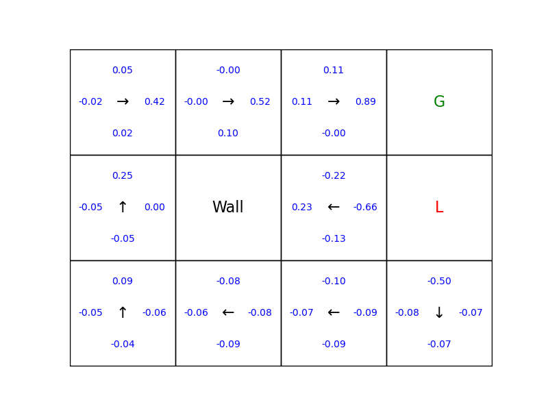

# Gridworld Q-Learning Solution (Online)

## Overview
This repository contains Q-learning-based solution for the 3x4 Gridworld problem.  
The agent learns an optimal policy to reach a goal state while avoiding a losing state and a wall. The environment includes stochastic movement, where actions succeed with 80% probability and deviate with 10% probability to either side. Weights & Biases (W&B) is used to track training details.

## Environment Details
- **Grid Size** : 3 rows x 4 columns
- **Start State** : (1, 1)
- **Goal State** : (3, 4) with reward +1
- **Lose State** : (2, 4) with penalties -1 / -200
- **Wall** : (2, 2)
- **Action** : Up, Down, Left, Right
- **Movement** : Stochastic with 80% probability of moving in the desired direction, 10% left, and 10% right. The agent stays in the same place if it hits a wall or grid boundary
- **Reawards**:
  - Goal state : + 1
  - Lose state: -1 or -200
  - Other states : -0.04
- **Reset** : Episode ends when the agent reaches the goal or lose state

## The online Q-learning algorithm


## Prerequirement
- Creat your account W&B  
https://wandb.ai/site

## Dependencies
```bash
python3 -m venv ~/gridworld_qlearning
source ~/gridworld_qlearning/bin/activate
```
- Install Dependencies:
```bash
pip install wandb numpy matplotlib
```

## Usage
Clone this repository

```bash
git clone https://github.com/knamatame0729/GridWorld_QLearning.git
cd GridWorld_QLearning
```

```bash
wandb sweep wandb_sweep.yaml
```
This will output a sweep ID. Then run the sweep with:

```bash
wandb agent <sewwp_id> --count 16
```

## Training Logs
Sample W&B runs and logs:  
https://wandb.ai/gridworld_qlearning/gridworld_q_learning_run

## Training Details
| L=-1 | L=-200 |
|------|--------|
|.png)|.png)|


## Learning Rate : 0.1 | Discoutn Factore : 0.7 | Exploration Rate : 0.1 
### Exploration Decay : 0.99
| Lose Reward : -1 | Lose Reward : -200 |
|--|--|
|||
|||


### Exploration Decay : 0.999
| Lose Reward : -1 | Lose Reward : -200 |
|--|--|
|||
|||

## Learning Rate : 0.1 | Discount Factor : 0.99 | Exploration Rate : 0.1
### Exploration Decay : 0.99
| Lose Reward : -1 | Lose Reward : -200 |
|--|--|
|||
|||

### Exploration Decay : 0.999
| Lose Reward : -1 | Lose Reward : -200 |
|--|--|
|||
|||

## Learning Rate : 0.5 | Discount Factor : 0.7 | Exploration Rate : 0.1
### Exploratino Decay : 0.99
| Lose Reward : -1 | Lose Reward : -200 |
|--|--|
|||
|||

### Exploration Decay : 0.999
| Lose Reward : -1 | Lose Reward : -200 |
|--|--|
|||
|||

## Learning Rate : 0.5 | Discount Factor : 0.99 | Exploration Rate : 0.1
### Exploration Decay : 0.99
| Lose Reward : -1 | Lose Reward : -200 |
|--|--|
|||
|||

### Exploration Decay : 0.999
| Lose Reward : -1 | Lose Reward : -200 |
|--|--|
|||
|||


# Questions
## 1) How hyperparameters (learning rate 𝛼, discount factor 𝛾, exploration schedule 𝜀 in case of online learning) affect learning
- When we run Q-learning for the gridworld problem, we noticed that the learning rate (𝛼)
determines how quickly the Q-value estimates get updated. If we set 𝛼 high, our agent
responds rapidly to the latest experience, which can help it adapt but also makes it prone
to instability. If 𝛼, the learning rate is low, then learning is slower and more stable,
because new experiences only gently influence the estimates.
- The discount factor (𝛾) tells our agent how much it should care about future rewards.
With a high 𝛾 (close to 1), we find that the agent prefers longer, safer paths toward the
goal, considering rewards that might be received in the future. With a lower 𝛾, the agent
is more greedy for immediate reward and may take riskier, shorter routes.
- Although the offline method uses a synthetic dataset, our offlinecode doesn’t have an
explicit exploration schedule (𝜖), we know that in online learning 𝜖 would decide how
much the agent tries new actions. If 𝜖 is too high, the agent spends more time exploring,
which is good early in training but inefficient later. Too little exploration could leave our
agent stuck with a suboptimal policy.  
  - Our choice of α=0.1 provides a good balance, allowing for steady and stable
convergence.
  - Our choice of γ=0.9 encourages the agent to value future rewards for more
balanced decision-making.
  - Our choice of 𝝐 = 0.1 for online Q learning. Epsilon was not used in offline
method as we created a synthetic dataset.

## 2) Does Q value converge first or the policy converge first?
In our implementation, we observe that the Q-values for each state-action pair gradually settle as
the agent trains on experience data. When the updates become very small, we know that the Q-
values have converged. Only after this stabilization do we extract the policy—by choosing, for
every state, the action with the highest Q-value. So, Q-value convergence definitely comes first,
and once the values stop changing, we can reliably read off the optimal policy for the gridworld.
We got the following graph in one of our online Q learning method execution. 

## 3) If you are curious, you may try to replace the penalty in sta (4, 2) from -1 by -200 and see how your solution is affected, and also if the solution makes sence when you compare the 2 cases (penalty -1 vs - 200).  
- We experimented with both trap penalties using our code. When the penalty in the trap state is -1,
our agent sometimes risks traveling near it, and the optimal policy may sometimes steer toward
the trap if the path seems worth it. But when we set the penalty to -200, we see a dramatic
change the agent strongly avoids the trap and will only take safer and sometimes longer paths to
reach the goal. This makes sense, because the value function punishes stepping into the trap
much more severely in the second case. The comparison shows us how sensitive Q-learning is to
the reward structure, changing one reward number can completely reshape the agent's behavior
and policy.

